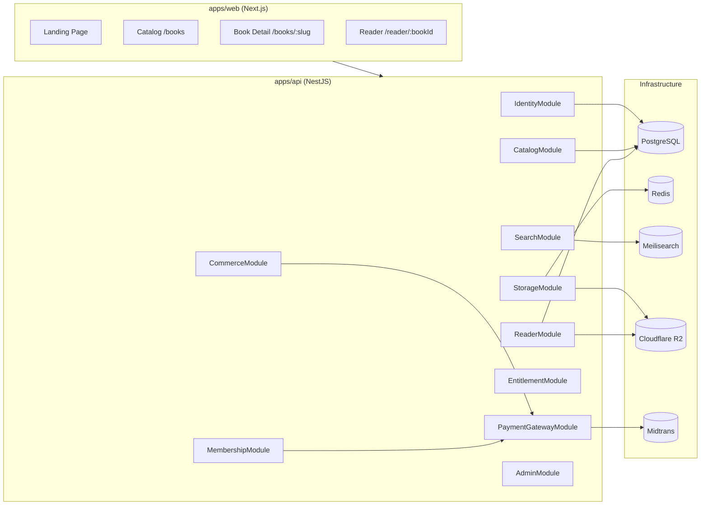

<div align="center">

<br />


<h1>EngineerYa</h1>

<p><strong>The Digital Engineering Library Platform</strong><br/>
Discover · Read · Own engineering textbooks with a secure watermarked reader,<br/>
real-time progress syncing, and Midtrans-powered commerce.</p>

---

[](https://github.com/dafawiradp/EngineerYa/actions/workflows/ci.yml)
[](LICENSE)
[](https://nodejs.org)
[](https://nestjs.com)
[](https://nextjs.org)
[](https://www.prisma.io)
[](CONTRIBUTING.md)

<br />

[**Live Demo**](https://engineerya.vercel.app) ·
[**API Docs**](docs/api.md) ·
[**Architecture**](docs/architecture.md) ·
[**Deployment**](docs/deployment.md) ·
[**Report a Bug**](https://github.com/dafawiradp/EngineerYa/issues) ·
[**Request a Feature**](https://github.com/dafawiradp/EngineerYa/issues)

</div>

---

## Table of Contents

- [Overview](#-overview)
- [Features](#-features)
- [Tech Stack](#-tech-stack)
- [Architecture](#-architecture)
- [Screenshots](#-screenshots)
- [Getting Started](#-getting-started)
- [Project Structure](#-project-structure)
- [Environment Variables](#-environment-variables)
- [Available Scripts](#-available-scripts)
- [API Documentation](#-api-documentation)
- [Deployment](#-deployment)
- [Roadmap](#-roadmap)
- [Known Limitations](#-known-limitations)
- [Contributing](#-contributing)
- [Acknowledgements](#-acknowledgements)
- [License](#-license)

---

## 🎯 Overview

**EngineerYa** is a production-grade, open-source digital library platform purpose-built for engineering education. It enables educators and publishers to host engineering textbooks with enterprise-grade content protection, and gives learners a rich, cross-device reading experience with reading progress sync and bookmarking.

The backend is built on **NestJS with Clean Architecture** (Domain → Application → Infrastructure → Presentation), keeping business rules completely isolated from frameworks and databases. The frontend is a **Next.js 14 App Router** portal with a premium dark-mode UI.

---

## ✨ Features

### For Readers
- 📚 **Catalog Browser** — filter published textbooks by discipline or category with typo-tolerant search
- 📖 **Secure Watermarked Reader** — per-request JPEG watermarking (user email + session ID, composed server-side with `sharp`) — nothing cached, no static deliveries
- 📌 **Bookmarks & Notes** — annotate any page with a personal note
- 📊 **Reading Progress Sync** — last-page and percentage tracked across sessions
- 📥 **Watermarked PDF Download** — per-user PDF generated on-demand with `pdf-lib`
- 🔐 **Google OAuth + Password Auth** — choose your sign-in method

### For Admins & Publishers
- 🗂️ **Book & Category CRUD** — full lifecycle management with draft/published/archived states
- ☁️ **Direct-to-R2 Upload** — PDFs uploaded straight to Cloudflare R2 via signed URLs; never transits the API process
- ⚙️ **Background PDF Rendering** — BullMQ worker rasterizes PDF pages to PNG at 150 DPI via `pdftoppm`
- 🔎 **Meilisearch Sync** — catalog changes propagate to the search index via domain events, not direct calls
- 📋 **Audit Logging** — every mutating `/admin/…` request is automatically logged (actor, action, IP, redacted body)
- 📈 **Analytics Overview** — users, revenue, active memberships, published books

### Commerce & Payments
- 💳 **Midtrans Snap Integration** — one-click payment popup for book purchases and subscriptions
- 🔗 **Webhook-driven Entitlements** — payment confirmations grant access idempotently (safe against webhook retries)
- 🎟️ **Entitlement Guard** — `EntitlementGuard` + `@RequireEntitlement()` protects reader and download routes
- 👑 **Membership Subscriptions** — live subscription check (no pre-granted rows per book)

---

## 🛠 Tech Stack

| Layer | Technology | Version |
|---|---|---|
| **API Framework** | [NestJS](https://nestjs.com) | ^10 |
| **Web Framework** | [Next.js](https://nextjs.org) | ^14 |
| **Language** | TypeScript | ^5.5 |
| **Database** | PostgreSQL | 16 |
| **ORM** | Prisma | ^5.18 |
| **Cache / Queue** | Redis + BullMQ | 7 / ^5 |
| **Search** | Meilisearch | v1.9 |
| **Object Storage** | Cloudflare R2 (S3-compatible) | — |
| **Auth** | JWT (dual-secret) + Passport | — |
| **Image Processing** | sharp | ^0.33 |
| **PDF Processing** | pdf-lib + poppler-utils | — |
| **Payments** | Midtrans Snap | — |
| **Styling** | Tailwind CSS | ^3.4 |
| **Container** | Docker + Compose | — |
| **CI** | GitHub Actions | — |

---

## 🏗 Architecture

EngineerYa follows **Clean Architecture** — business rules are completely isolated from frameworks and infrastructure:

```
Domain  →  Application  →  Infrastructure  →  Presentation
```



→ Full documentation: **[docs/architecture.md](docs/architecture.md)**

---

## 📸 Screenshots

> Screenshots are captured from the running development environment. Refer to **[docs/screenshots.md](docs/screenshots.md)** for full walkthrough with annotated UI wireframes.

| Landing Page | Library Catalog | Book Detail | Document Reader |
|---|---|---|---|
| Hero with animated gradient headline and CTA | Filterable grid with discipline tags | Cover + metadata + buy/read CTAs | Per-request watermarked JPEG stream |

---

## 🚀 Getting Started

### Prerequisites

- **Node.js** `v20.0.0` or higher
- **Docker** & **Docker Compose**

### Quick Start

```bash
# 1. Clone the repository
git clone https://github.com/dafawiradp/EngineerYa.git
cd EngineerYa/engineerya

# 2. Set up environment variables
cp .env.example .env

# 3. Install workspace dependencies
npm install

# 4. Start local infrastructure (Postgres, Redis, Meilisearch)
docker compose up -d postgres redis meilisearch

# 5. Generate Prisma client and run database migrations
npm run db:generate

# 6. Start development servers
npm run dev:api    # API  → http://localhost:4000/api/v1/health
npm run dev:web    # Web  → http://localhost:3000
```

> 💡 **Google OAuth** is optional. Leave `GOOGLE_CLIENT_ID` empty in `.env` — the API starts with `"not-configured"` placeholders and all non-OAuth flows work normally.

---

## 📁 Project Structure

```
engineerya/
├── .github/
│   └── workflows/ci.yml          # Lint · Typecheck · Build · Test
├── apps/
│   ├── api/                      # NestJS backend
│   │   ├── src/
│   │   │   ├── common/           # Guards, decorators, filters, interceptors
│   │   │   ├── infrastructure/prisma/
│   │   │   └── modules/          # identity · catalog · search · storage
│   │   │                         # reader · entitlement · commerce
│   │   │                         # payment-gateway · membership
│   │   │                         # audit · admin · watermark
│   │   └── Dockerfile
│   └── web/                      # Next.js 14 App Router
│       ├── app/                  # Routes (page · layout · error · loading)
│       │   ├── books/[slug]/     # Dynamic book detail
│       │   └── reader/[bookId]/  # Watermarked document reader
│       └── components/           # Navbar · Footer · BookCard
├── packages/
│   ├── config/                   # Zod-validated env schema
│   ├── database/                 # Prisma schema + client re-export
│   └── shared-types/             # Shared DTOs and enums
├── docs/                         # Architecture · DB · API · Deployment docs
├── docker-compose.yml
├── .env.example
└── package.json                  # npm workspaces root
```

---

## 🔧 Environment Variables

Copy `.env.example` to `.env`. The API validates all variables at boot using **Zod** — misconfiguration causes an immediate, human-readable exit.

| Variable | Required | Description |
|---|---|---|
| `DATABASE_URL` | ✅ | PostgreSQL connection URL |
| `REDIS_URL` | ✅ | Redis connection URL |
| `MEILISEARCH_HOST` | ✅ | Meilisearch host URL |
| `MEILISEARCH_API_KEY` | ✅ | Meilisearch master key |
| `JWT_ACCESS_SECRET` | ✅ | Min 16 chars — `openssl rand -base64 48` |
| `JWT_REFRESH_SECRET` | ✅ | Min 16 chars — must differ from access secret |
| `GOOGLE_CLIENT_ID` | | Google OAuth (optional) |
| `GOOGLE_CLIENT_SECRET` | | Google OAuth (optional) |
| `R2_ACCOUNT_ID` | | Cloudflare R2 (required for uploads) |
| `R2_ACCESS_KEY_ID` | | Cloudflare R2 |
| `R2_SECRET_ACCESS_KEY` | | Cloudflare R2 |
| `MIDTRANS_SERVER_KEY` | | Midtrans payments (required for commerce) |
| `MIDTRANS_CLIENT_KEY` | | Midtrans payments |

→ Full reference: **[docs/deployment.md#environment-variables-reference](docs/deployment.md#environment-variables-reference)**

---

## 📜 Available Scripts

Run from the **workspace root** (`engineerya/`):

| Script | Description |
|---|---|
| `npm run dev:web` | Start Next.js dev server |
| `npm run dev:api` | Start NestJS API in watch mode |
| `npm run build` | Build all workspaces |
| `npm run lint` | ESLint across all workspaces |
| `npm run lint:fix` | ESLint with auto-fix |
| `npm run typecheck` | TypeScript type checking across all workspaces |
| `npm run format` | Prettier format all source files |
| `npm run test` | Jest across all workspaces |
| `npm run clean` | Remove all build artifacts |
| `npm run db:generate` | Generate Prisma client from schema |
| `npm run db:migrate` | Run Prisma migrations (development) |

---

## 📚 API Documentation

Full REST API reference with request/response examples, auth requirements, and rate limit information:

→ **[docs/api.md](docs/api.md)**

**Quick reference — base URL:** `http://localhost:4000/api/v1`

| Group | Base Path |
|---|---|
| Authentication | `/auth` |
| Public Catalog | `/books`, `/categories` |
| Search | `/search` |
| Reader | `/reader/:bookId` |
| Commerce | `/purchases`, `/downloads` |
| Payments | `/payments/webhook` |
| Memberships | `/memberships` |
| Admin | `/admin/…` |
| Health | `/health` |

---

## 🌍 Deployment

The stack deploys as:
- **API + workers + databases** → VPS (Docker Compose) or Railway/Render
- **Next.js frontend** → Vercel

```bash
# Production (VPS)
docker compose up -d --build
docker compose exec api npx prisma migrate deploy --schema=/app/packages/database/prisma/schema.prisma
```

→ Complete step-by-step guide: **[docs/deployment.md](docs/deployment.md)**

---

## 🗺 Roadmap

<details>
<summary><strong>Completed Phases</strong></summary>

- [x] **Phase 0** — Monorepo scaffold, Docker Compose, CI pipeline
- [x] **Phase 1** — Identity: JWT dual-secret, Google OAuth, RBAC
- [x] **Phase 2** — Catalog: books, categories, `fileKey` isolation
- [x] **Phase 3** — Search: Meilisearch, domain-event sync
- [x] **Phase 4** — Storage: Cloudflare R2, direct upload, PDF rendering worker
- [x] **Phase 5** — Reader: manifest, page streaming
- [x] **Phase 6** — Watermarking: per-request `sharp` watermark composition
- [x] **Phase 7** — Progress & bookmarks sync
- [x] **Phase 8** — Entitlements & commerce: Midtrans Snap, webhook, `EntitlementGuard`
- [x] **Phase 9** — Memberships: subscription lifecycle, live entitlement check
- [x] **Phase 10** — Admin dashboard, analytics aggregation
- [x] **Phase 11** — Hardening: `helmet`, global exception filter, rate limiting
- [x] **Phase 12** — GitHub readiness: README, docs, CI, CONTRIBUTING, LICENSE

</details>

**Upcoming:**

- [ ] **Phase 13** — EPUB reader support
- [ ] **Phase 14** — AI reading assistant (annotations, summaries)
- [ ] **Phase 15** — Collaborative highlights (team memberships)
- [ ] **Phase 16** — Native mobile app (React Native)

---

## ⚠️ Known Limitations

| Limitation | Notes |
|---|---|
| **Table of Contents** | Reader manifest returns `tableOfContents: []`. PDF outline extraction is a future enhancement (Phase 13). |
| **OAuth token delivery** | The Google OAuth callback currently returns tokens as JSON from a browser-redirected GET. Production hardening (one-time code or httpOnly cookie) is tracked as a follow-up. |
| **Meilisearch cold start** | On first boot, the search index is empty. Books must be published (or re-published) to appear in search. |
| **poppler-utils required** | The PDF rendering worker requires `pdftoppm` from `poppler-utils`. The Docker image includes it; bare-metal installs need to add it manually. |
| **Single currency** | Commerce is currently hardcoded to IDR (Indonesian Rupiah) via Midtrans. Multi-currency support is a future roadmap item. |
| **No email verification** | Password-based registration does not verify the email address. An email confirmation flow is planned. |

---

## 🤝 Contributing

We welcome contributions of all kinds! Please read the [Contributing Guide](CONTRIBUTING.md) before opening a pull request.

**Quick steps:**
1. Fork the repository
2. Create a feature branch: `git checkout -b feat/your-feature`
3. Make your changes and add tests
4. Ensure all checks pass: `npm run lint && npm run typecheck && npm run test`
5. Open a Pull Request targeting the `develop` branch

All contributors are expected to follow our [Code of Conduct](CODE_OF_CONDUCT.md).

Security vulnerabilities should be reported via [SECURITY.md](SECURITY.md) — **do not open public issues for security bugs**.

---

## 🙏 Acknowledgements

EngineerYa was built on the shoulders of exceptional open-source projects:

| Project | Role |
|---|---|
| [NestJS](https://nestjs.com) | API framework with first-class DI and module system |
| [Next.js](https://nextjs.org) | React framework with App Router and streaming |
| [Prisma](https://www.prisma.io) | Type-safe ORM and migration tooling |
| [Meilisearch](https://www.meilisearch.com) | Lightning-fast typo-tolerant search engine |
| [BullMQ](https://bullmq.io) | Redis-backed job queue for background workers |
| [sharp](https://sharp.pixelplumbing.com) | High-performance Node.js image processing |
| [pdf-lib](https://pdf-lib.js.org) | PDF creation and modification in pure JavaScript |
| [Zod](https://zod.dev) | TypeScript-first schema validation |
| [Tailwind CSS](https://tailwindcss.com) | Utility-first CSS framework |
| [Midtrans](https://midtrans.com) | Indonesian payment gateway |
| [Cloudflare R2](https://www.cloudflare.com/developer-platform/r2/) | Zero-egress object storage |

---

## 📄 License

Copyright © 2026 EngineerYa Contributors.

This project is licensed under the **MIT License** — see the [LICENSE](LICENSE) file for details.

---

<div align="center">

Made with ❤️ for the engineering education community.

[⬆ Back to top](#)

</div>
