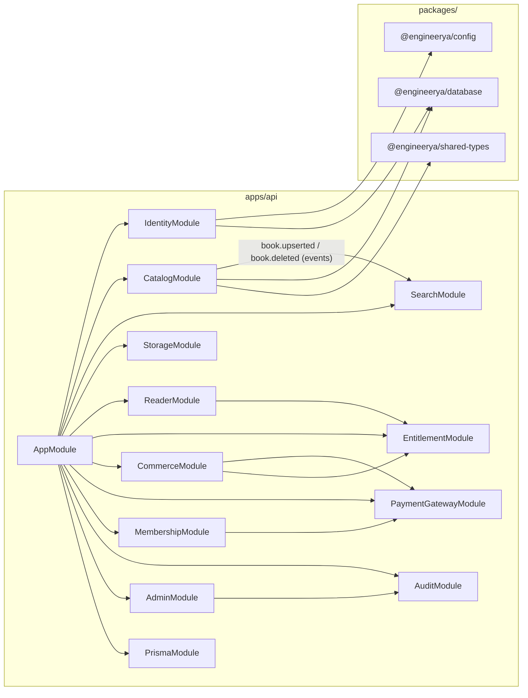

# Architecture — EngineerYa

> This document describes the high-level system design, module boundaries, and data-flow patterns used in EngineerYa. It is intended for contributors and technical evaluators.

---

## Table of Contents

- [System Overview](#system-overview)
- [Monorepo Layout](#monorepo-layout)
- [Backend Architecture](#backend-architecture)
- [Frontend Architecture](#frontend-architecture)
- [Infrastructure Layer](#infrastructure-layer)
- [Module Dependency Graph](#module-dependency-graph)
- [Data Flow Diagrams](#data-flow-diagrams)
  - [Authentication Flow](#authentication-flow)
  - [Book Upload & Rendering Flow](#book-upload--rendering-flow)
  - [Purchase & Entitlement Flow](#purchase--entitlement-flow)
  - [Reader Page Streaming Flow](#reader-page-streaming-flow)
- [Security Architecture](#security-architecture)
- [Key Design Decisions](#key-design-decisions)

---

## System Overview

EngineerYa is a **digital engineering library platform** composed of three independently deployable tiers:

| Tier | Technology | Responsibility |
|---|---|---|
| **Web** | Next.js 14 (App Router) | User-facing portal — browse, read, purchase |
| **API** | NestJS 10 (Express adapter) | Business logic, auth, entitlement, payments |
| **Workers** | NestJS + BullMQ | PDF rasterization, background processing |

Supporting services (all containerised via Docker Compose):

| Service | Role |
|---|---|
| PostgreSQL 16 | Primary relational database |
| Redis 7 | Job queue broker (BullMQ) + cache |
| Meilisearch v1.9 | Typo-tolerant full-text search |
| Cloudflare R2 | Object storage for PDFs and rasterized page images |

---

## Monorepo Layout

```
engineerya/                   ← workspace root
├── apps/
│   ├── api/                  ← NestJS backend (Clean Architecture)
│   │   └── src/
│   │       ├── common/       ← Shared guards, decorators, filters, interceptors
│   │       ├── infrastructure/
│   │       │   └── prisma/   ← PrismaModule + PrismaService
│   │       └── modules/      ← Domain modules (see Module Dependency Graph)
│   └── web/                  ← Next.js 14 App Router frontend
│       ├── app/              ← Routes (page.tsx, layout.tsx, error.tsx, …)
│       └── components/       ← Shared UI components
├── packages/
│   ├── config/               ← Zod-validated env schema (shared by api)
│   ├── database/             ← Prisma schema + generated client re-export
│   └── shared-types/         ← API contract DTOs and enums shared by web + api
├── .github/workflows/        ← CI pipeline
├── docker-compose.yml        ← Local dev service orchestration
└── package.json              ← npm workspace manifest
```

---

## Backend Architecture

The API follows **Clean Architecture** with four explicit layers per domain module:

```
Domain  →  Application  →  Infrastructure  →  Presentation
```

| Layer | Contents | Allowed to depend on |
|---|---|---|
| **Domain** | Entities, Repository interfaces (ports), Domain errors | Nothing (pure TypeScript) |
| **Application** | Use-cases, Application services | Domain only |
| **Infrastructure** | Prisma repos, bcrypt, JWT, strategy adapters | Domain + external libraries |
| **Presentation** | NestJS controllers, DTOs, Mappers | Application use-cases |

**Key rule:** the `domain/` layer has zero NestJS or Prisma imports. Dependency inversion is enforced via DI tokens (e.g. `USER_REPOSITORY = Symbol(…)`).

---

## Frontend Architecture

The web portal uses **Next.js 14 App Router** conventions:

```
app/
├── layout.tsx               ← Root layout with Inter font + dark theme tokens
├── page.tsx                 ← Landing / Hero page (Server Component)
├── error.tsx                ← Global error boundary (Client Component)
├── loading.tsx              ← Global loading skeleton
├── not-found.tsx            ← 404 fallback
├── books/
│   ├── page.tsx             ← Catalog listing (Client Component for filters)
│   └── [slug]/page.tsx      ← Book detail + buy/preview CTAs (Client Component)
└── reader/
    └── [bookId]/page.tsx    ← Secure document reader (Client Component)
```

**Rendering strategy:**
- Static pages (landing) → **Server Component** (no JS bundle shipped)
- Filter-heavy pages (catalog) → **Client Component** (local `useState` for filters)
- Reader → **Client Component** (paginated streaming, page navigation state)

---

## Infrastructure Layer

### Prisma Service

`PrismaService` extends `PrismaClient` and calls `$connect()` on `onModuleInit`. It is provided globally through `PrismaModule` (exported), so every domain module receives the same singleton connection pool.

### Config Package

`packages/config/src/index.ts` exports a single `loadEnv()` function that runs Zod `safeParse` against `process.env` at boot time. If any required variable is missing or malformed, the process exits immediately with a descriptive error — fail-fast before serving a single request.

---

## Module Dependency Graph



---

## Data Flow Diagrams

### Authentication Flow

```
Client                  API (/auth)              PostgreSQL
  │                         │                        │
  ├─POST /register─────────►│                        │
  │  {email, password, name}│                        │
  │                         ├─bcrypt.hash()──────────►│
  │                         │                        ├─INSERT users
  │                         │◄─UserEntity────────────┤
  │                         ├─sign(accessJWT)         │
  │                         ├─sign(refreshJWT)        │
  │                         ├─bcrypt.hash(refreshJWT)►│
  │                         │                        ├─INSERT refresh_tokens
  │◄──{accessToken,─────────┤                        │
  │    refreshToken}        │                        │
```

### Book Upload & Rendering Flow

```
Admin Browser          API (/admin/storage)         Cloudflare R2       BullMQ Worker
     │                        │                          │                    │
     ├─POST /upload-url───────►│                          │                    │
     │◄─signedPutURL──────────┤                          │                    │
     ├─PUT {raw PDF}──────────────────────────────────►  │                    │
     │                        │                          │                    │
     ├─POST /render───────────►│                          │                    │
     │                        ├─BullMQ.add({bookId})──────────────────────────►│
     │◄─202 Accepted──────────┤                          │                    │
     │                        │                          ├─GET pdf────────────►│
     │                        │                          │◄─stream────────────┤
     │                        │                          │   ┌─pdftoppm loop──►│
     │                        │                          │   │ for each page   │
     │                        │◄─PUT page-N.png──────────┤◄──┘                │
     │                        │  (update Book.pageCount) │                    │
```

### Purchase & Entitlement Flow

```
Client            API (/purchases)      MidtransService      Webhook (/payments)
  │                    │                      │                      │
  ├─POST {bookId}──────►│                      │                      │
  │                    ├─createOrder()─────────►│                      │
  │                    │◄─{snapToken,────────── │                      │
  │◄─{purchaseId,──────┤   redirectUrl}         │                      │
  │   snapToken}       │                        │                      │
  │                    │                        │                      │
  ├─[User pays via Snap popup]                  │                      │
  │                    │                        │──POST webhook────────►│
  │                    │                        │  {order_id, status}  │
  │                    │                        │                      ├─verify signature
  │                    │                        │                      ├─UPDATE purchases SET status=PAID
  │                    │                        │                      ├─INSERT entitlements (idempotent upsert)
  │                    │                        │                      │
```

### Reader Page Streaming Flow

```
Client (browser)          API (/reader)          Cloudflare R2       sharp
     │                        │                       │                │
     ├─GET /reader/bookId/──── │                       │                │
     │   pages/42             │                       │                │
     │                        ├─EntitlementGuard       │                │
     │                        │  (purchase OR active   │                │
     │                        │   membership check)    │                │
     │                        ├─GET page-42.png────────►│                │
     │                        │◄─raw PNG stream──────── │                │
     │                        ├─compositeWatermark()────────────────────►│
     │                        │   (email + sessionId    │               │
     │                        │    + timestamp tile)    │               │
     │                        │◄─JPEG buffer─────────────────────────── │
     │                        ├─INSERT watermark_tokens                 │
     │◄─image/jpeg stream─────┤                        │                │
```

---

## Security Architecture

| Concern | Implementation |
|---|---|
| **Credential storage** | `passwordHash` via bcrypt (cost 12). Raw password never persisted. |
| **Refresh token storage** | Only a SHA-256 hash stored (`tokenHash`). Raw token never in DB. |
| **Token pair isolation** | Access and refresh tokens signed with *different* secrets — a leaked access token cannot be replayed as a refresh token. |
| **Refresh token rotation** | On every use, the old token is revoked and a new one is issued. Reuse of a superseded token is detectable. |
| **File key isolation** | `Book.fileKey` is never selected by any controller query. It is not present on `BookDetailDto` at the *type* level, preventing accidental exposure. |
| **Input validation** | `ValidationPipe({ whitelist: true, forbidNonWhitelisted: true })` globally strips and rejects unknown fields. |
| **Rate limiting** | Global 120 req/min baseline; reader endpoints 60 req/min; download endpoints 10 req/min. |
| **Security headers** | `helmet()` applied globally (HSTS in production, CSP, X-Frame-Options, etc.). |
| **Webhook trust** | Midtrans webhooks verified via SHA-512 signature (`orderId + statusCode + grossAmount + serverKey`). No bearer token guard on the webhook route. |
| **Error leakage** | `GlobalExceptionFilter` returns only a sanitised error shape in production; full stack traces logged server-side only. |
| **CORS** | Origin restricted to `WEB_URL` in production; open in development. |

---

## Key Design Decisions

### Why domain events for search sync (not direct calls)?

`CatalogModule` emits `book.upserted` / `book.deleted` events; `SearchModule`'s `BookIndexListener` reacts. This keeps Catalog unaware that Search exists — one-way dependency, no circular imports. Draft/archived books are evicted from the index on the same event, not filtered at query time.

### Why idempotent entitlement grants?

Midtrans can deliver the same webhook multiple times. The `Entitlement` table has a `UNIQUE(userId, bookId, type)` constraint. Grants use `upsert` with `skipDuplicates`, so any number of retries produces exactly one row.

### Why per-request watermarking (no cached watermarked files)?

If a cached watermarked file leaks, it could be shared — but the watermark would still point to the original requester. Per-request composition means the same page produces a *different* image for every user on every request, so distributing a screenshot doesn't help an attacker distribute a clean copy. Nothing watermarked is ever written back to object storage.

### Why membership access is checked live (not pre-granted per book)?

A subscriber with READ access would otherwise require one `Entitlement` row per book in the catalog. At scale this is an unbounded write storm on subscribe. Instead, `EntitlementGuard` checks `Membership.status = ACTIVE AND expiresAt > now()` at request time.
