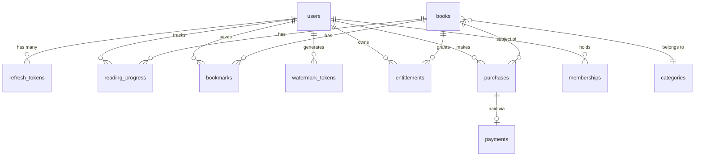

# Database Schema — EngineerYa

> This document covers the complete Prisma schema, entity-relationship model, design rationale for each table, and indexing strategy.

---

## Table of Contents

- [Overview](#overview)
- [Entity-Relationship Diagram](#entity-relationship-diagram)
- [Enumerations](#enumerations)
- [Tables](#tables)
  - [users](#users)
  - [refresh_tokens](#refresh_tokens)
  - [categories](#categories)
  - [books](#books)
  - [reading_progress](#reading_progress)
  - [bookmarks](#bookmarks)
  - [watermark_tokens](#watermark_tokens)
  - [entitlements](#entitlements)
  - [purchases](#purchases)
  - [payments](#payments)
  - [memberships](#memberships)
  - [audit_logs](#audit_logs)
- [Indexing Strategy](#indexing-strategy)
- [Migration Workflow](#migration-workflow)
- [Connection Management](#connection-management)

---

## Overview

EngineerYa uses **PostgreSQL 16** as the primary data store, accessed exclusively through **Prisma ORM**. The schema is defined in [`packages/database/prisma/schema.prisma`](../packages/database/prisma/schema.prisma) and is the single source of truth for both the database structure and the generated TypeScript client.

**Key design principles:**
- All primary keys use `uuid()` — avoids sequential ID enumeration attacks.
- Table names use `snake_case` (`@@map`) while Prisma model names use `PascalCase`.
- Cascade deletes are used for user-owned data (progress, bookmarks, entitlements). Restrict is used for business-critical references (book ↔ purchase) to prevent silent orphaning.
- Sensitive fields (`passwordHash`, `fileKey`) have explicit isolation at the type level — they cannot appear in API response DTOs by design.

---

## Entity-Relationship Diagram



---

## Enumerations

| Enum | Values | Used by |
|---|---|---|
| `UserRole` | `USER`, `EDITOR`, `ADMIN` | `users.role` |
| `BookStatus` | `DRAFT`, `PUBLISHED`, `ARCHIVED` | `books.status` |
| `EntitlementType` | `READ`, `DOWNLOAD` | `entitlements.type` |
| `EntitlementSource` | `PURCHASE`, `MEMBERSHIP`, `PROMO` | `entitlements.source` |
| `PurchaseStatus` | `PENDING`, `PAID`, `FAILED`, `CANCELLED` | `purchases.status` |
| `PaymentStatus` | `PENDING`, `SUCCESS`, `FAILED`, `EXPIRED` | `payments.status` |

---

## Tables

### users

The central identity entity. Supports both password-based and OAuth login from the same row.

| Column | Type | Notes |
|---|---|---|
| `id` | `uuid` PK | Auto-generated |
| `email` | `text` UNIQUE | Login identifier |
| `name` | `text` | Display name |
| `passwordHash` | `text?` | `null` for OAuth-only users |
| `oauthProvider` | `text?` | `"google"` or `null` |
| `oauthId` | `text?` | Provider's user ID |
| `role` | `UserRole` | Default: `USER` |
| `createdAt` | `timestamp` | Auto |
| `updatedAt` | `timestamp` | Auto-updated |

**Index:** `(oauthProvider, oauthId)` — fast OAuth lookup on every Google callback.

---

### refresh_tokens

Stores hashed refresh tokens for JWT rotation. The raw token is never persisted.

| Column | Type | Notes |
|---|---|---|
| `id` | `uuid` PK | |
| `userId` | `uuid` FK → users | Cascade delete |
| `tokenHash` | `text` UNIQUE | `bcrypt.hash(rawToken)` |
| `expiresAt` | `timestamp` | Checked on use |
| `revokedAt` | `timestamp?` | Set on rotation/logout |
| `createdAt` | `timestamp` | |

**Design note:** On every `/auth/refresh` call, the old token's `revokedAt` is set and a new row is inserted. If a superseded token is ever presented, the system can detect reuse.

---

### categories

Supports a self-referential hierarchy (e.g. `Engineering → Software Engineering → Backend`).

| Column | Type | Notes |
|---|---|---|
| `id` | `uuid` PK | |
| `name` | `text` | Display name |
| `slug` | `text` UNIQUE | URL-safe identifier |
| `parentId` | `uuid?` FK → categories | `SetNull` on parent delete |

**Index:** `(parentId)` — used to fetch subcategories by parent.

---

### books

The core catalog entity. `fileKey` is the only field that names the private R2 object — it is never selected by any public or admin controller query.

| Column | Type | Notes |
|---|---|---|
| `id` | `uuid` PK | |
| `title` | `text` | |
| `slug` | `text` UNIQUE | Server-generated, deduplicated |
| `description` | `text` | |
| `authorNames` | `text[]` | PostgreSQL array |
| `discipline` | `text` | e.g. `"Software"`, `"Electrical"` |
| `coverUrl` | `text` | Public CDN URL |
| `fileKey` | `text` | **Private R2 object key — never in any DTO** |
| `pageCount` | `int` | Written by the rendering worker |
| `priceCents` | `int` | Stored in smallest currency unit |
| `status` | `BookStatus` | Default: `DRAFT` |
| `publishedAt` | `timestamp?` | |
| `categoryId` | `uuid` FK → categories | `Restrict` on category delete |

**Indexes:**
- `(categoryId)` — catalog filtering
- `(status, publishedAt)` — sorted published catalog

---

### reading_progress

One row per user-book pair, upserted on every page turn.

| Column | Type | Notes |
|---|---|---|
| `id` | `uuid` PK | |
| `userId` | `uuid` FK → users | Cascade |
| `bookId` | `uuid` FK → books | Cascade |
| `lastPage` | `int` | Default: `1` |
| `percentComplete` | `float` | `0.0` – `100.0` |
| `updatedAt` | `timestamp` | Auto-updated |

**Unique constraint:** `(userId, bookId)` — ensures a single progress record per reader per book.

---

### bookmarks

A user may have multiple bookmarks per book (different pages with optional notes).

| Column | Type | Notes |
|---|---|---|
| `id` | `uuid` PK | |
| `userId` | `uuid` FK → users | Cascade |
| `bookId` | `uuid` FK → books | Cascade |
| `page` | `int` | Page number |
| `note` | `text?` | Optional annotation |
| `createdAt` | `timestamp` | |

**Index:** `(userId, bookId)` — list all bookmarks for a reader in a given book.

---

### watermark_tokens

A traceability log — every page streamed to a user produces one row. Not used for access control.

| Column | Type | Notes |
|---|---|---|
| `id` | `uuid` PK | |
| `userId` | `uuid` FK → users | Cascade |
| `bookId` | `uuid` | (no FK — soft reference) |
| `page` | `int` | |
| `sessionId` | `text` | From the reader session |
| `issuedAt` | `timestamp` | |

**Purpose:** If a watermarked page image is leaked, the row can (in principle) correlate it back to a user, book, page, and session timestamp.

---

### entitlements

The access-control source of truth for purchased content.

| Column | Type | Notes |
|---|---|---|
| `id` | `uuid` PK | |
| `userId` | `uuid` FK → users | Cascade |
| `bookId` | `uuid` FK → books | Cascade |
| `type` | `EntitlementType` | `READ` or `DOWNLOAD` |
| `source` | `EntitlementSource` | `PURCHASE`, `MEMBERSHIP`, `PROMO` |
| `grantedAt` | `timestamp` | |

**Unique constraint:** `(userId, bookId, type)` — idempotent grants. Webhook retries upsert against this constraint without accumulating duplicate rows.

---

### purchases

Tracks the lifecycle of a book purchase.

| Column | Type | Notes |
|---|---|---|
| `id` | `uuid` PK | |
| `userId` | `uuid` FK → users | Cascade |
| `bookId` | `uuid` FK → books | **Restrict** on book delete |
| `priceCents` | `int` | Snapshot price at time of purchase |
| `status` | `PurchaseStatus` | Default: `PENDING` |
| `createdAt` / `updatedAt` | `timestamp` | |

**Index:** `(userId, status)` — user's purchase history filtered by status.

---

### payments

One-to-one with `Purchase`. Stores the raw Midtrans payload for auditing.

| Column | Type | Notes |
|---|---|---|
| `id` | `uuid` PK | |
| `purchaseId` | `uuid` UNIQUE FK → purchases | Cascade |
| `provider` | `text` | Default: `"midtrans"` |
| `providerRef` | `text?` | Midtrans `transaction_id` |
| `status` | `PaymentStatus` | Synced from webhook |
| `rawPayload` | `jsonb?` | Full Midtrans callback body |

**Index:** `(providerRef)` — webhook lookup by Midtrans transaction reference.

---

### memberships

Tracks subscription lifecycle. Status is updated via webhook — never pre-set to `ACTIVE` on row creation.

| Column | Type | Notes |
|---|---|---|
| `id` | `uuid` PK | |
| `userId` | `uuid` FK → users | Cascade |
| `plan` | `text` | e.g. `"student"`, `"professional"` |
| `status` | `text` | `PENDING → ACTIVE → EXPIRED | CANCELLED` |
| `startsAt` | `timestamp` | Set at payment confirmation, not checkout |
| `expiresAt` | `timestamp` | `startsAt + plan duration` |

**Index:** `(userId, status)` — active membership lookup per user.

---

### audit_logs

Append-only log written by `AdminAuditInterceptor` for every mutating `/admin/…` request.

| Column | Type | Notes |
|---|---|---|
| `id` | `uuid` PK | |
| `actorId` | `uuid?` | JWT subject (`null` for anonymous) |
| `action` | `text` | e.g. `"PATCH /admin/books/123"` |
| `targetType` | `text` | e.g. `"Book"` |
| `targetId` | `text?` | |
| `metadata` | `jsonb?` | Redacted request body |
| `ip` | `text?` | Client IP from `X-Forwarded-For` |
| `createdAt` | `timestamp` | |

**Indexes:** `(actorId)`, `(targetType, targetId)`, `(createdAt)` — support filtering by actor, resource, or time window.

---

## Indexing Strategy

All indexes were chosen based on the query patterns of the application layer, not speculatively:

| Index | Table | Query it supports |
|---|---|---|
| `(oauthProvider, oauthId)` | users | Google OAuth callback lookup |
| `(userId)` | refresh_tokens | Revoke all tokens for a user |
| `(parentId)` | categories | Fetch subcategories |
| `(categoryId)` | books | Catalog filter by category |
| `(status, publishedAt)` | books | Sorted published catalog |
| `(userId, bookId)` | reading_progress | Upsert progress |
| `(userId, bookId)` | bookmarks | List user bookmarks per book |
| `(userId, bookId)` | watermark_tokens | Audit trail lookup |
| `(bookId, page)` | watermark_tokens | Page-level traceability |
| `(userId)` | entitlements | Check user's entitlements |
| `(userId, status)` | purchases | User purchase history |
| `(providerRef)` | payments | Webhook → purchase lookup |
| `(userId, status)` | memberships | Active subscription check |
| `(actorId)` | audit_logs | Actor activity history |
| `(targetType, targetId)` | audit_logs | Resource audit trail |
| `(createdAt)` | audit_logs | Time-based audit queries |

---

## Migration Workflow

```bash
# Apply pending migrations in development (creates migration SQL + applies)
npm run db:migrate

# Apply migrations in production (applies only, no new migrations created)
npm run --workspace=packages/database migrate:deploy

# Open Prisma Studio (visual database browser)
npm run --workspace=packages/database studio

# Regenerate Prisma client after schema changes
npm run db:generate
```

> ⚠️ **Never run `migrate:dev` against a production database.** Use `migrate:deploy` only.

---

## Connection Management

`PrismaService` in `apps/api/src/infrastructure/prisma/prisma.service.ts` extends `PrismaClient` and calls `$connect()` on `onModuleInit`. Prisma manages a connection pool internally (default: `min=2, max=10` connections).

For production deployments with Prisma behind a connection pooler (e.g. PgBouncer), use the `?pgbouncer=true` query parameter in `DATABASE_URL`.
